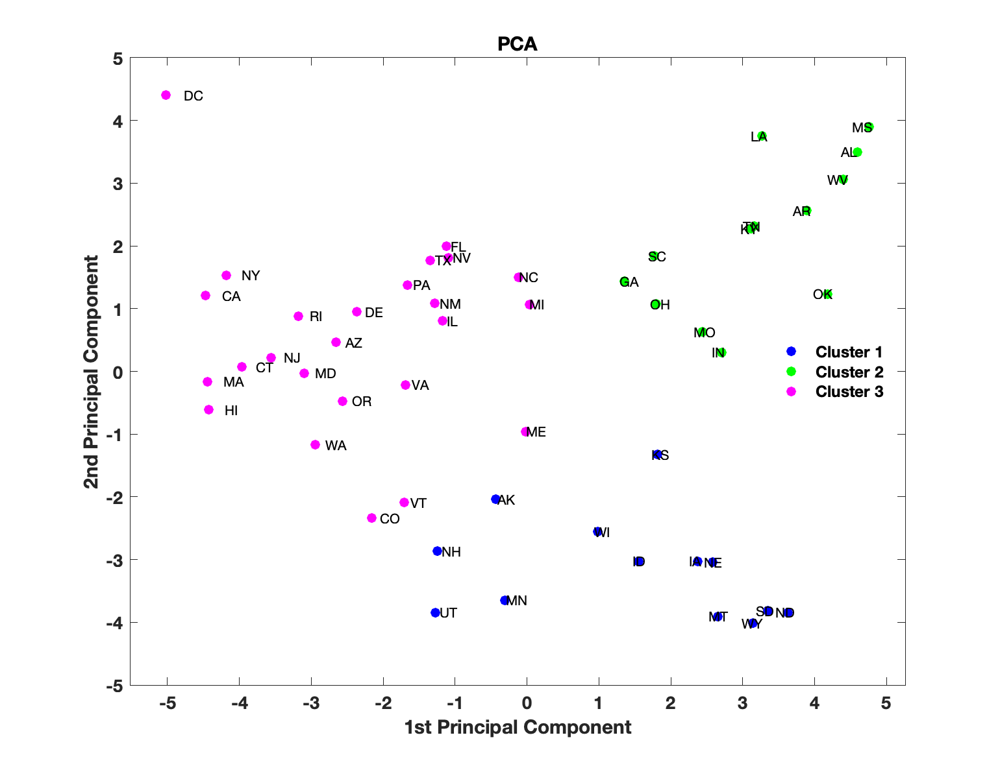
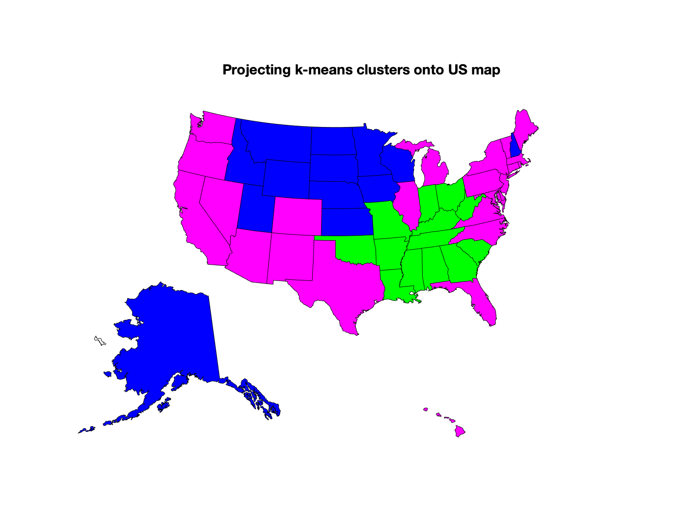

### Welcome to Alex and Rogelio's CSE8803 Project: Leveraging Regional Similarity in Deep Epidemic Forecasting

 
<br>Alex Rodriguez (Left) & Rogelio Rodriguez Gonzalez (Right)


## Abstract
Forecasting emerging pandemics such as COVID-19 using purely data-driven models is challenging, in no small part because data is very sparse. In such a scenario, purely data-driven models need to leverage as much relevant data is available. For example, leveraging similarity between regions based on geographical closeness can be helpful but we should not limit ourselves to this type of relations. Therefore, we propose to leverage similarity between regions based on a latent space build from 'static' and 'dynamic' features from each region. Static features of a specific region include demographic information such as age structure, population density, and prevalence of comorbidities that pose an increased risk for COVID-19 complications (e.g., diabetes, cancer, kidney disease, diseases weakening the immune system, etc.). On the other hand, dynamic features are signals such as mobility, hospitalizations, confirmed cases, etc. By projecting regions into a temporal latent space (i.e. for each region and time frame, we have a different latent representation), we can leverage both static and dynamic similarity. Our specific goals are as follows. (1) Find in the literature epidemiologically relevant static and dynamic information; (2) develop a neural architecture to leverage static and dynamic similarity. By achieving these goals, we expect that a deep forecasting model will be more accurate, especially at the early stages of the pandemic.

## Main Results

# Static Module


<br> We use "static" regional features to cluster US states. PCA  with k-means clustering (left) and clustering projections on the US map (right).


```markdown
Syntax highlighted code block

# Header 1
## Header 2
### Header 3

- Bulleted
- List

1. Numbered
2. List

**Bold** and _Italic_ and `Code` text

[Link](url) and 

```

## Slides & Code

You can find our project slides here [slides](https://github.com/RogerRln/Deep-Epidemic-Forecasting/blob/main/DOC/Project_slides.pptx)

You can find our written project here [project (PDF)](https://github.com/RogerRln/Deep-Epidemic-Forecasting/blob/main/DOC/)

You can find our code here [code](https://github.com/RogerRln/Deep-Epidemic-Forecasting/tree/main/SRC%20(code))


### Support or Contact

Having trouble with Pages? Check out our [documentation](https://docs.github.com/categories/github-pages-basics/) or [contact support](https://github.com/contact) and we’ll help you sort it out.
